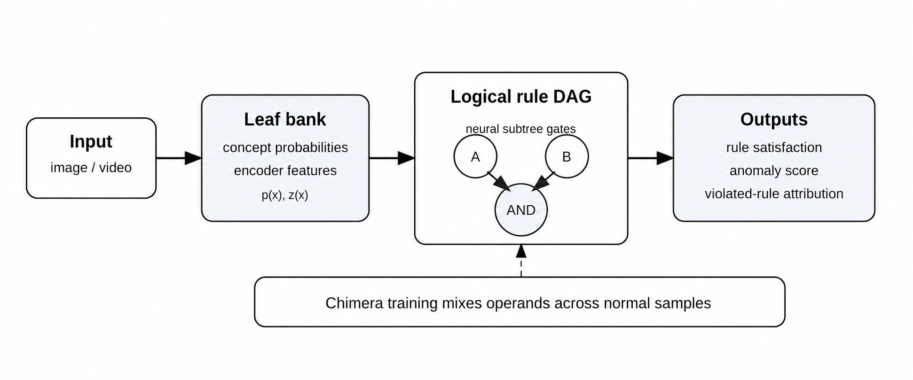
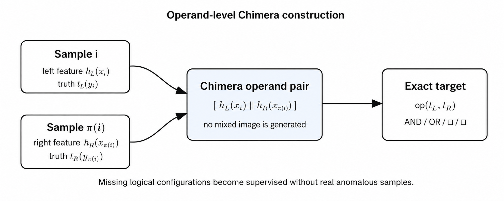

# Chimera Training for Logical Anomaly Detection

[](#installation)
[](#installation)
[](LICENSE)
[](#scope-and-limitations)

A neuro-symbolic anomaly detector that learns to evaluate logical constraints **without requiring real rule-violating anomalies during training**.

Rules are explicit directed acyclic graphs over perceptual concepts. Their internal logical nodes are learned neural gates. **Chimera training** creates missing truth configurations by combining subtree operands from different normal samples and assigning the exact Boolean target of the corresponding operator.

<p align="center">
  
</p>

## Core idea

Many anomalies are not merely rare inputs. They are violations of semantic expectations:

- an action occurs without a precondition;
- a relation is present without the corresponding objects;
- a temporal consequence is absent when its context is active;
- an image simultaneously exhibits evidence for mutually exclusive concepts.

The system separates perception from structured evaluation:

1. A **leaf concept bank** maps an image or video to concept probabilities and encoder features.
2. Each rule is compiled into a **logical DAG** with `AND`, `OR`, `IMPLIES`, `IFF`, and edge negations.
3. Internal **subtree gates** map child features to a parent representation and satisfaction probability.
4. Exact Boolean propagation over concept labels supplies local supervision at every internal node.
5. Rule violations are aggregated into an anomaly score with rule- and subformula-level attribution.

## Why Chimera training is needed

Normal same-image data may omit the only informative configuration. For an implication

$$
A \Rightarrow B
$$

the violating assignment $A=1$ and $B=0$ may never occur during training. A same-image learner can therefore collapse to a trivial always-normal solution.

For a binary node, Chimera training selects operands from different samples. The mixed operand is $u_i^{\mathrm{chim}} = [h_L(x_i), h_R(x_{\pi(i)})]$.

Its target is computed exactly as $t_i^{\mathrm{chim}} = \mathrm{op}(t_L(y_i), t_R(y_{\pi(i)}))$.

The target is **not interpolated**. No anomalous image is synthesized. The construction intervenes directly on the operands of the logical operator.

<p align="center">
  
</p>

## Current manuscript results

Mean rule-level anomaly AUROC on the currently reported rule sets:

| Dataset | Independent-events evaluator | Same-image semantic training | Chimera neural evaluator |
|---|---:|---:|---:|
| CLEVRER | 0.750 | 0.500 | **0.833** |
| OpenImages | 0.821 | 0.500 | **0.899** |
| VidOR | 0.490 | 0.500 | **0.724** |

The current ablation indicates that Chimera counterfactual supervision is the dominant empirical contribution. The modular rule-DAG evaluator adds local semantic supervision, inspectable subformula scores, and reusable learned subtrees without a material loss relative to a Chimera-trained monolithic predictor.

Detailed values are in [`results/table2.csv`](results/table2.csv). They should be regenerated from the final paper configuration before an archival release.

## Installation

A clean Python 3.10 or 3.11 environment is recommended.

```bash
python -m venv .venv
source .venv/bin/activate          # Windows: .venv\Scripts\activate
python -m pip install --upgrade pip
```

Install DGL using the wheel appropriate for the local PyTorch/CUDA configuration, then install the project:

```bash
pip install -e ".[all]"
```

CPU-only users can usually use:

```bash
pip install dgl
pip install -e ".[dev,video]"
```

## Quick qualitative demos

### MNIST: forbidden conjunction `1 AND 7`

MNIST is single-label, so `1 AND 7` never occurs in a real image. Chimera training obtains positive conjunction examples by combining the `1` operand from one normal sample with the `7` operand from another.

```bash
python demos/mnist_forbidden_conjunction.py \
  --pairs "1,7" \
  --negatives chimeras_only
```

The script downloads MNIST, trains or loads a shared concept bank, trains the conjunction gate, and writes score-sorted grids and CSV files to `runs/mnist_1_7/`.

For a true digit-7 image, the anomaly score is

$$
s(x)=\widehat{P}(1\land 7\mid x)
$$

High-scoring examples are 7s whose representation also carries unusually strong 1-like evidence.

### CIFAR-10: forbidden conjunction `cat AND dog`

```bash
python demos/cifar10_forbidden_conjunction.py \
  --pairs "cat,dog" \
  --negatives chimeras_only \
  --augment \
  --eval_leaf
```

CIFAR-10 is more difficult and noisier than MNIST. Report the leaf-bank test accuracy with any qualitative result.

### Compare same-image and Chimera training

```bash
python demos/compare_training_modes.py \
  --dataset mnist \
  --pair "1,7"
```

This wrapper runs the same experiment with ordinary same-image supervision and with Chimera-only supervision, then assembles the generated extreme-score grids into a comparison image.

## Full experiments

The large experiment drivers are preserved under `experiments/`:

```text
experiments/
├── clevrer/train.py
├── openimages/train.py
└── vidor/train.py
```

These are research scripts rather than lightweight demos. They require separately downloaded datasets, substantial storage, and experiment-specific preprocessing. See each experiment directory for expected layouts and example commands.

Representative rule types include:

- `collide(A,B) => collide_before_half(A,B)`;
- `relationship => subject_object_present`;
- `(A1 AND A2) => B`;
- `A => (B1 OR B2)`;
- contextual human-object relation rules in VidOR.

## Package layout

```text
src/chimera_logic/
├── semantics.py   # exact Boolean targets
├── chimera.py     # reusable operand-level mixing helpers
├── evaluator.py   # hard propagation and neural DAG evaluation
└── trainer.py     # bottom-up gate training and lineage-aware caching
```

Rule graphs follow these conventions:

| Field | Meaning |
|---|---|
| `ndata['mask']` | `1` for concept leaf, `0` for internal node |
| `ndata['x']` | concept ID at a leaf |
| `ndata['y']` | `1=IFF`, `2=IMPLIES`, `3=AND`, `4=OR` |
| `edata['neg']` | `-1` for negated child edge, `+1` otherwise |
| `edata['pos']` | optional operand order for implication |

## Reusable subtree gates

The trainer can cache learned subtrees using a lineage-aware key containing:

- operator and complete subtree structure;
- ordered operands for implication;
- canonicalized operands for commutative operators;
- edge negations;
- feature dimension and architecture tag;
- fingerprint of the upstream encoder parameters.

This prevents silent reuse after the semantics of the feature representation changes.

## Outputs

The demo and experiment scripts generate combinations of:

```text
manifest.json
metrics.json
scores_*.csv
per_rule_metrics.csv
grids/*.png
checkpoints/*.pt
```

Checkpoints, datasets, caches, and run directories are intentionally excluded from version control.

## Testing

Tests that do not require DGL:

```bash
pytest tests/test_semantics.py tests/test_chimera.py
```

Full tests after installing DGL:

```bash
pytest
```

## Scope and limitations

The method assumes:

- an adequate concept interface;
- meaningful rules or a defensible rule-mining procedure;
- enough support to train the primitive concept predictors;
- careful validation of rules to avoid encoding dataset bias as normality.

The MNIST and CIFAR-10 demonstrations illustrate the mechanism and qualitative ranking. Benchmark claims should be based on the structured CLEVRER, OpenImages, and VidOR experiments rather than on the toy demos.

## Citation

If you use this repository, please cite:

**Alejandro Ascarate, Leo Lebrat, Rodrigo Santa Cruz, Clinton Fookes, and Olivier Salvado.**  
*When Rule Violations Are Rare: Chimera Training for Logical Anomaly Detection.*  
arXiv:2605.26171, 2026.  
[Paper on arXiv](https://arxiv.org/abs/2605.26171)

```bibtex
@article{ascarate2026chimera,
  title         = {When Rule Violations Are Rare: Chimera Training for Logical Anomaly Detection},
  author        = {Ascarate, Alejandro and Lebrat, Leo and Santa Cruz, Rodrigo and Fookes, Clinton and Salvado, Olivier},
  year          = {2026},
  eprint        = {2605.26171},
  archivePrefix = {arXiv},
  primaryClass  = {cs.LG},
  url           = {https://arxiv.org/abs/2605.26171}
}
```

The repository includes [`CITATION.cff`](CITATION.cff) for software citation metadata.

## License

MIT. See [`LICENSE`](LICENSE).
